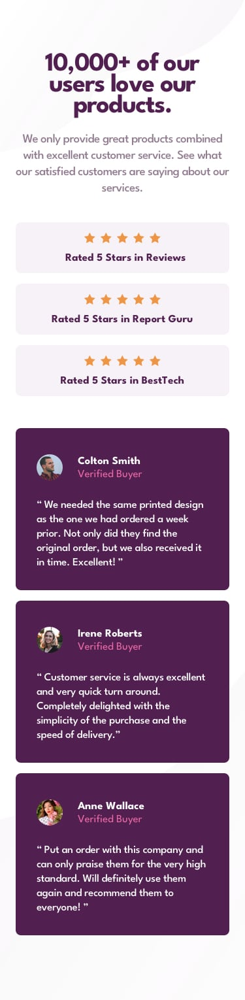

# Frontend Mentor - Social proof section solution

[Preview](https://santiagolarae.github.io/social-proof-section/)

This is a solution to the [Social proof section challenge on Frontend Mentor](https://www.frontendmentor.io/challenges/social-proof-section-6e0qTv_bA). Frontend Mentor challenges help you improve your coding skills by building realistic projects. 

## Table of contents

- [Overview](#overview)
  - [The challenge](#the-challenge)
  - [Screenshot](#screenshot)
  - [Links](#links)
  - [Built with](#built-with)

## Overview

### The challenge

Users should be able to:

- View the optimal layout for the section depending on their device's screen size

### Screenshot

### Links

- Repo URL: (https://github.com/SantiagoLaraE/social-proof-section/)
- Live Site URL: (https://santiagolarae.github.io/social-proof-section/)

### Built with

- Semantic HTML5 markup
- CSS